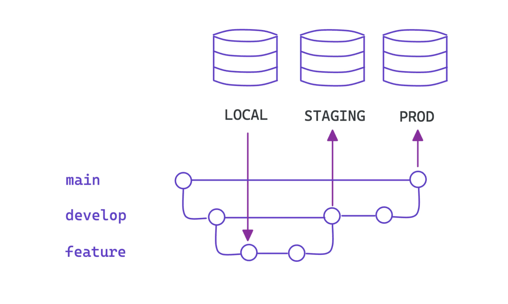

# Contribution Guidelines <!-- omit from toc -->
The contribution guidelines for the [UniPath.io](https://www.UniPath.io) project maintained by the UMLCloudComputing Club follow the [industry best practices](https://about.gitlab.com/topics/version-control/version-control-best-practices/) that are often used in conjunction with a <a href="">CI/CD pipeline</a>. There are <a href="https://www.jetbrains.com/teamcity/ci-cd-guide/concepts/branching-strategy/">a number</a> of way that the branches used can be organized; We utilize a simplified implementation of what may be found in a real production environment, this is explained in the proceeding sections.

## Table of Contents <!-- omit from toc -->
- [Git Architecture](#git-architecture)
  - [Branch Organization](#branch-organization)
- [Procedure For Contributing](#procedure-for-contributing)
  - [Cooperation and Personal Expectations](#cooperation-and-personal-expectations)
  - [Commit](#commit)
  - [Branches](#branches)
  - [Pull Requests](#pull-requests)
- [Code and Documentation Expectations](#code-and-documentation-expectations)

## Git Architecture 
The UMLCloudComputing club, as you can see utilizes [GitHub](https://github.com/) as a <a href="https://git-scm.com/book/en/v2/Git-Basics-Working-with-Remotes">remote Git registry</a>. The Repository for [UniPath.io](https://www.UniPath.io) will exist both *locally* on your system once you have performed a ```git clone https://github.com/UMLCloudComputing/UniPath.io.git``` operation on your computer, and remotely on GitHub's servers. The changes you make locally, are not reflected on the remote repository that other contributors, and AWS pulls from until you have both [committed](https://git-scm.com/docs/git-commit) the changes, and <a href="https://git-scm.com/docs/git-push">pushed</a> them to the remote repository. If you run the command [```git branch```](https://git-scm.com/docs/git-branch) you will see all of the branches that currently exist (locally) of the repository. [Branches](https://git-scm.com/book/en/v2/Git-Branching-Branches-in-a-Nutshell) are the git objects, and organization methods we use to perform parallel, but distinct development on a project. There are two main ways we combine the code from a branch into the main, or production branches of a repository. The first method is a [merge](https://git-scm.com/docs/git-merge), this merges one branch's history into another branches. This is useful when you are updating a **non-main** or **non-production** branch. This is because no review is performed on the code that is now being contributed. The other method is a [pull request](https://docs.github.com/en/pull-requests/collaborating-with-pull-requests/proposing-changes-to-your-work-with-pull-requests/about-pull-requests), this is similar to a merge, as the result is the same; however the process is vastly different as a contributor must review, and provide feedback before the changes are merged and take effect. 

If you are an external collaborator, that is you are not a member of the organization. You can <a href="https://docs.github.com/en/get-started/quickstart/fork-a-repo">fork</a>, the repository and perform a pull request. You may request membership from one of the EBoard members.   
### Branch Organization
The structure planned for the [UniPath.io](https://www.UniPath.io) project's branches are as follows.

1. A protected **main** branch. This is where AWS will pull changes from when updating the AWS Resources hosting the site.
   * Protected from delete
   * Requires two reviews and approvals before a merge occurs  
2. A protected **develop** branch. This is where approved changes will be deployed in a test environment
   * Protected from delete
   * Requires one review and approval before a merge occurs 
3. Feature Branches. Each proposed feature will have a branch created where members will contribute changes.
   * No protections (Anarchy!)



## Procedure For Contributing

There are a few expectations, and requests we make for those contributing to the project. 

### Cooperation and Personal Expectations
1. We as a group understand this is a learning process for everyone, so mistakes are **OK** and *expected*. Please learn from them!
2. Please be respectful in the PR, and Issue comments! 
3.  \<Insert More!\>

### Commit 
1. Each commit is expected to have a meaningful **Subject**. 
   * This should not be empty, have random characters or an ascii face in it
2. Each commit should have a body message containing a summery of the work done
3. Each commit should have a meaningful set of work done. Do not make a large number (say 300) commits implementing a single function.
   * That is we should not over saturate the number of commits

### Branches
1. Each Feature is expected to originate from the **development** branch. That is so *your* contributions to a new *feature* do not conflict with any yet to be merged features. 
2. Each Feature branch is expected to update *documents* and *code* relating to **only** that feature. You should make a seperate branch for any updates not related to the feature you are implementing.
   * That is if you are implementing a new feature, say a "Export as xls" feature you should **not** then decide to fix a completely unrelated bug in the same branch.
3. Each branch is expected to have a [Pull Request](https://docs.github.com/en/pull-requests/collaborating-with-pull-requests/proposing-changes-to-your-work-with-pull-requests/about-pull-requests) with the subsequent number of reviews from the relevant Club Members.

### Pull Requests
1. The pull request is expected to have a meaningful Subject Line
   * What is the feature it is implementing. 
2. The body should contain rational as to why this should be included in the project
   * Ex: Adds feature to export the students pathway to a xls file for offline storage, allowing for...
   * Ex: Fixes bug related to Issue #N 
3. The body should contain information as to what this pull request changes. 

## Code and Documentation Expectations
Please refer any question to Martin or one of the EBoard members! Until this is formalized you should follow the general best practices related to formatting, and *please* comment and document your code!